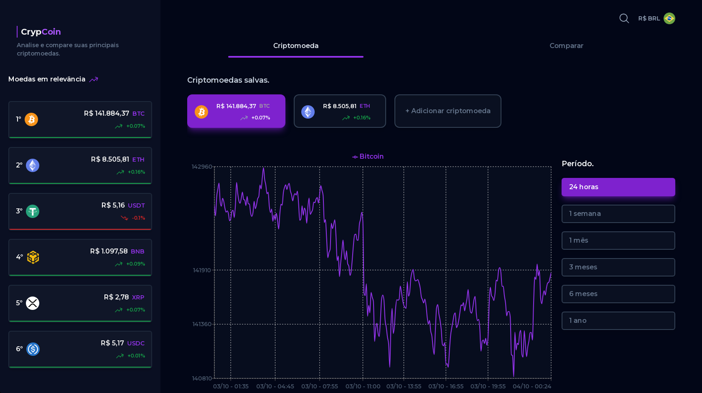

# CrypCoin

O CrypCoin é um site de cotações de criptomoedas que oferece diversar funcionalidades para o usuário. Dentre elas podemos listar algumas:

- Cotação de criptomoedas em tempo real.
- Comparar duas criptomoedas e seus preços.
- Gráficos interativos com variação de períodos.
- Salvar criptomoedas para facilitar a visualizão dos seus preços.
- Conversão para diversas moedas (BRL, USD...).

## Como posso acessar o site?

Você pode acessar o site clicando [aqui.](https://taima-crypcoin.netlify.app)

## Instalando e rodando o projeto na máquina.

Além de acessar o site você pode rodar o projeto na sua própria máquina seguindo os passos a seguir:

1. Instale o NodeJS na sua máquina.
2. Clone esse repositório no seu computador.
3. Dentro do diretório do projeto execute o `npm install` para instalar as depências do projeto.
4. Depois execute o `npm run dev`, ele vai abrir um servidor no seu computador na seguinte URL: [localhost:5173](http://localhost:5173)

O site está totalmente responsível, então você pode acessá-lo no seu dispositivo móvel.
